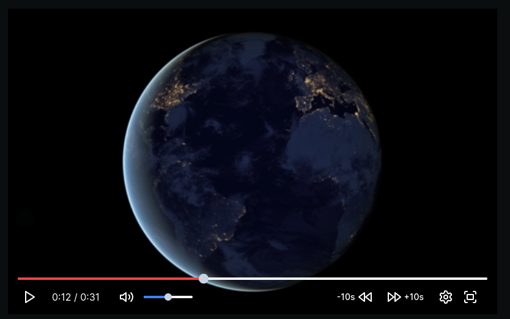

# HTML Video Player Customizations



Playing around with making custom controls for the html `<video>` player. Mostly doable but a lot of custom logic is necessary to replace the native controls, including but not limited to:

- Play / Pause button and its state
- Seek bar
- current video time and total duration
- Volume slider (mute/unmute was so confusing)
- All shortcut keys (though native controls don't really have those)
- Fullscreen
- Settings
- Auto-hiding and showing controls

### TL;DR about below notes

If you try to imitate the youtube player like I am, you're going to have to f*ck around with things quite a bit.

### About Fullscreen Custom Controls

It sucks hard.

### About mute / unmute

Stay away from using the video element's `muted` field. It's evil. Oh, also, muting the volume apparently amounts to simply setting the volume to 1 (not 0, because why would that make sense?)


### About auto hiding and showing controls

This one seems simple at the beginning, but then you realise that controls are not simply shown and hidden as the mouse has entered and left, but also depends on whether the video is paused.

To add to the complexity, the mouse could be moving inside the video but if you're using it, for example, to adjust the volume slider then the move event is not emitted to the parent because obviously WHY WOULD IT. That would make things so much easier...

### About the seekbar

The seekbar is easy to show, but making interaction with it smooth means that whenever the user is changing it manually, it should not actually change the video's time until the user lets go of the mouse.

Also, you need to implement showing the video's buffered time manually.

---

This is a [Next.js](https://nextjs.org/) project bootstrapped with [`create-next-app`](https://github.com/vercel/next.js/tree/canary/packages/create-next-app).

## Getting Started

First, run the development server:

```bash
npm run dev
# or
yarn dev
# or
pnpm dev
# or
bun dev
```

Open [http://localhost:3000](http://localhost:3000) with your browser to see the result.

You can start editing the page by modifying `app/page.tsx`. The page auto-updates as you edit the file.

This project uses [`next/font`](https://nextjs.org/docs/basic-features/font-optimization) to automatically optimize and load Inter, a custom Google Font.

## Learn More

To learn more about Next.js, take a look at the following resources:

- [Next.js Documentation](https://nextjs.org/docs) - learn about Next.js features and API.
- [Learn Next.js](https://nextjs.org/learn) - an interactive Next.js tutorial.

You can check out [the Next.js GitHub repository](https://github.com/vercel/next.js/) - your feedback and contributions are welcome!

## Deploy on Vercel

The easiest way to deploy your Next.js app is to use the [Vercel Platform](https://vercel.com/new?utm_medium=default-template&filter=next.js&utm_source=create-next-app&utm_campaign=create-next-app-readme) from the creators of Next.js.

Check out our [Next.js deployment documentation](https://nextjs.org/docs/deployment) for more details.
